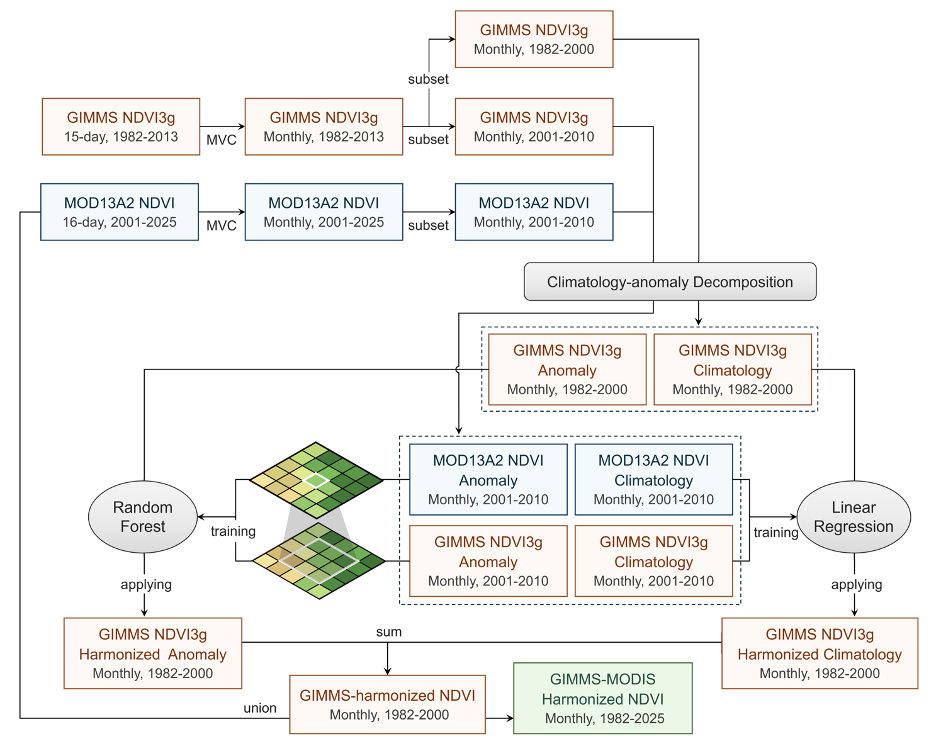

# Central Asia 44-Year AVHRR–MODIS NDVI Fusion Dataset (1982–2025)
# 44AVHRR–MODIS NDVI

[](LICENSE) [](https://creativecommons.org/licenses/by/4.0/) [](#)

A 44-year (1982–2025) long-term NDVI dataset over Central Asia generated by harmonizing and fusing AVHRR and MODIS observations through a machine-learning-based spatiotemporal fusion framework. Companion code and data for the associated research paper.

💻 Code: https://github.com/yuezc/ndvi-fusion

## Background

Central Asia is dominated by arid and semi-arid ecosystems, where sparse vegetation, persistent cloud contamination, snow cover, and differences among satellite observing systems can substantially reduce the availability and consistency of long-term NDVI observations. AVHRR provides the temporal continuity required for monitoring vegetation dynamics since the early 1980s, but its relatively coarse spatial resolution and sensor inconsistencies constrain detailed regional applications. MODIS provides improved spatial and radiometric observations but covers a much shorter period. This project harmonizes and fuses AVHRR and MODIS NDVI observations to reconstruct a spatially and temporally consistent 44-year NDVI record from 1982 to 2025, supporting long-term environmental and vegetation studies across Central Asia.

## Dataset

| Property | Description |
|---|---|
| Study area | Central Asia: Kazakhstan, Kyrgyzstan, Tajikistan, Turkmenistan, and Uzbekistan; approximately 46–88°E, 35–56°N |
| Source sensors | AVHRR and MODIS |
| Period | 1982–2025 |
| Record length | 44 years |
| Spatial resolution | The synthetic generator uses 0.25° AVHRR and 0.10° MODIS demonstration grids; preprocessing aligns MODIS to the AVHRR grid |
| Temporal resolution | Monthly (the scripts use 12 observations per year) |
| Format | GeoTIFF stacks (script outputs); source `NDVI/` files are individual `.tif` files |
| CRS | EPSG:4326 in the synthetic generator; final input/output CRS is inherited from the AVHRR profile |
| Scale factor | No explicit scale-factor conversion is present in the five scripts |
| NoData | The synthetic generator uses `src.config.NODATA_VALUE`; production input NoData is inherited from configured profiles |
| Product type | Long-term harmonized / fused NDVI time series |

### File naming convention

The application script writes fixed output names rather than date-stamped individual files:

- `fused_1982_2000.tif` — reconstructed historical segment.
- `fused_validation_2011_2013.tif` — held-out validation prediction.
- `fused_1982_2025.tif` — complete 1982–2025 monthly stack.
- `fused_train_2001_2010.npy` — training-period reconstructed array.

The synthetic generator reads/writes source stacks named `198201-201312.tif` (AVHRR) and `200101-202512.tif` (MODIS). Individual files already present under `NDVI/` follow a `YYYYMM.tif` pattern; their production naming semantics require confirmation.

## Workflow

```text
AVHRR long-term NDVI (1982–2025)
          │
          ├── preprocessing / MODIS-to-AVHRR grid alignment ──┐
          │                                                   │
MODIS NDVI (2001–2025) ───────────────────────────────────────┤
                                                              ↓
                 climatology regression + anomaly RF fusion model
                                                              ↓
                    fused long-term NDVI series
                                                              ↓
                              1982–2025 (44 years)
```

The implemented model trains on 2001–2010 overlap, predicts AVHRR 1982–2000 as MODIS-like NDVI, produces a held-out 2011–2013 prediction, and concatenates the reconstructed 1982–2000 segment with MODIS 2001–2025.

## Repository structure

```text
ndvi-fusion/
├── 00_generate_synthetic_data.py
├── 01_preprocess.py
├── 02_train.py
├── 03_apply.py
├── 04_validate.py
├── raw/
│   └── source NDVI GeoTIFF files
├── NDVI/
│   └── source NDVI GeoTIFF files
├── requirements.txt
├── LICENSE
├── .gitignore
└── README.md
```

- `00_generate_synthetic_data.py` — creates small synthetic AVHRR/MODIS stacks for pipeline debugging; the code documents demonstration grids and Central Asian subset bounds.
- `01_preprocess.py` — loads AVHRR and MODIS stacks, automatically generates synthetic inputs when source files are missing, resamples MODIS to the AVHRR grid using the project preprocessing module, writes aligned stacks, and saves a validity mask and grid metadata.
- `02_train.py` — computes monthly climatologies, fits pixel-wise climatology linear regression, builds 3×3-neighbour anomaly features, and fits per-pixel random-forest anomaly models for 2001–2010.
- `03_apply.py` — applies the trained models to reconstruct 1982–2000, predicts 2011–2013, and writes the complete 1982–2025 fused stack.
- `04_validate.py` — evaluates the held-out 2011–2013 period and writes global, pixel-wise, regional time-series, anomaly-trajectory, and vegetation-class diagnostic outputs.
- `raw/` — source AVHRR/MODIS or intermediate input data.
- `NDVI/` — corrected, fused, or final NDVI products.

## Usage

The five scripts import an external project package named `src` (including `config`, `io_utils`, `preprocess`, `decomposition`, `train_models`, and `validate`). That package is not included in this core-script-only release, so the commands below require the companion source package and its configured data paths.

```bash
pip install -r requirements.txt
python 00_generate_synthetic_data.py   # optional; creates demo inputs when configured
python 01_preprocess.py
python 02_train.py
python 03_apply.py
python 04_validate.py                  # optional output/validation check
```

The scripts do not define argparse command-line parameters; paths and date ranges are read from `src.config`.

## Licenses

- Code: MIT License (see [LICENSE](LICENSE)).
- Dataset: CC BY 4.0.

## Workflow diagram


